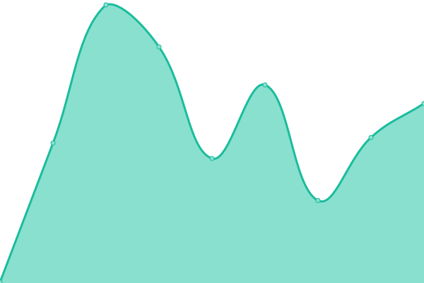
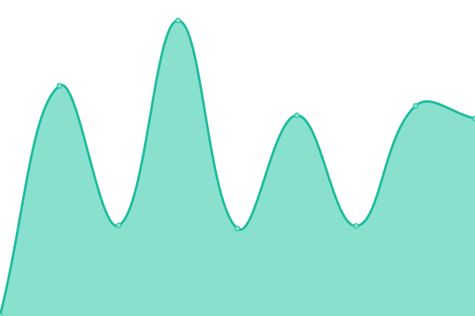

# [📈 Live Status](https://Ryval-X.github.io/Upptime): <!--live status--> **🟧 Partial outage**

This repository contains the open-source uptime monitor and status page for [Ryval-X](https://Ryval-X.github.io/Upptime), powered by [Upptime](https://github.com/upptime/upptime).

With [Upptime](https://upptime.js.org), you can get your own unlimited and free uptime monitor and status page, powered entirely by a GitHub repository. We use [Issues](https://github.com/Ryval-X/Upptime/issues) as incident reports, [Actions](https://github.com/Ryval-X/Upptime/actions) as uptime monitors, and [Pages](https://Ryval-X.github.io/Upptime) for the status page.

<!--start: status pages-->
<!-- This summary is generated by Upptime (https://github.com/upptime/upptime) -->
<!-- Do not edit this manually, your changes will be overwritten -->
<!-- prettier-ignore -->
| URL | Status | History | Response Time | Uptime |
| --- | ------ | ------- | ------------- | ------ |
|  [Knocen-dev](https://dev1.knocen.com) | 🟥 Down | [knocen-dev.yml](https://github.com/Ryval-X/Upptime/commits/HEAD/history/knocen-dev.yml) | 

 0ms
     
 | 

<a href="https://Ryval-X.github.io/Upptime/history/knocen-dev">0.00%</a>
    

|  [Knocen-dev](https://dev1.knocen.com/testing) | 🟥 Down | [knocen-dev.yml](https://github.com/Ryval-X/Upptime/commits/HEAD/history/knocen-dev.yml) | 

 0ms
     
 | 

<a href="https://Ryval-X.github.io/Upptime/history/knocen-dev">0.00%</a>
    

|  [Knocen-qa](https://qa1.knocen.com) | 🟩 Up | [knocen-qa.yml](https://github.com/Ryval-X/Upptime/commits/HEAD/history/knocen-qa.yml) | 

 201ms
     
 | 

<a href="https://Ryval-X.github.io/Upptime/history/knocen-qa">97.46%</a>
    

|  [Knocen-uat](https://uat1.knocen.com) | 🟩 Up | [knocen-uat.yml](https://github.com/Ryval-X/Upptime/commits/HEAD/history/knocen-uat.yml) | 

 241ms
     
 | 

<a href="https://Ryval-X.github.io/Upptime/history/knocen-uat">100.00%</a>
    

|  [PickWinners](https://dev-api.pickwinners.io) | 🟩 Up | [pick-winners.yml](https://github.com/Ryval-X/Upptime/commits/HEAD/history/pick-winners.yml) | 

 334ms
     
 | 

<a href="https://Ryval-X.github.io/Upptime/history/pick-winners">100.00%</a>
    

|  [Scoutflix](https://devapi.scoutflix.com) | 🟥 Down | [scoutflix.yml](https://github.com/Ryval-X/Upptime/commits/HEAD/history/scoutflix.yml) | 

 0ms
     
 | 

<a href="https://Ryval-X.github.io/Upptime/history/scoutflix">0.00%</a>
    

<!--end: status pages-->

[**Visit our status website →**](https://Ryval-X.github.io/Upptime)

## 📄 License

- Powered by: [Upptime](https://github.com/upptime/upptime)
- Code: [MIT](./LICENSE) © [Anand Chowdhary](https://anandchowdhary.com), supported by [Pabio](https://pabio.com)
- Data in the `./history` directory: [Open Database License](https://opendatacommons.org/licenses/odbl/1-0/)
